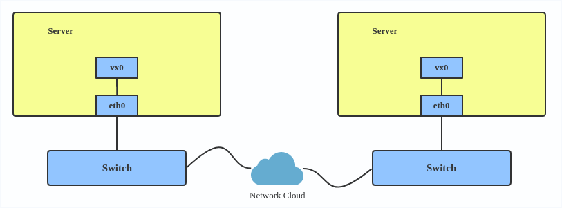

# Advanced Network Virtualization and Routing Training README

## Table of Contents

1. [Introduction](#introduction)
2. [Understanding VLAN](#understanding-vlan)
   - [VLAN Overview](#vlan-overview)
   - [Creating VLAN](#creating-vlan)
3. [Understanding VXLAN](#understanding-vxlan)
   - [VXLAN Overview](#vxlan-overview)
   - [Creating VXLAN](#creating-vxlan)
4. [Understanding MACVLAN](#understanding-macvlan)
   - [MACVLAN Overview](#macvlan-overview)
   - [Creating MACVLAN](#creating-macvlan)
5. [Setting Up Macvlan Network](#setting-up-macvlan-network)
   - [Creating Macvlan Interface](#creating-macvlan-interface)
   - [Configuring Network Interfaces](#configuring-network-interfaces)
   - [Editing resolv.conf](#editing-resolvconf)
   - [Adding Default Gateway](#adding-default-gateway)
6. [Using Docker with Macvlan](#using-docker-with-macvlan)
   - [Creating Macvlan Network in Docker](#creating-macvlan-network-in-docker)
   - [Running Containers in Macvlan Network](#running-containers-in-macvlan-network)
   - [Connecting Containers](#connecting-containers)
7. [Installing Networking Tools in Containers](#installing-networking-tools-in-containers)
8. [Setting Up veth Pair with systemd-nspawn](#setting-up-veth-pair-with-systemd-nspawn)
9. [Using `dhclient` for Dynamic IP Configuration](#using-dhclient-for-dynamic-ip-configuration)
10. [Interconnecting Network Namespaces](#interconnecting-network-namespaces)
      - [Using veth Pairs](#using-veth-pairs)
12. [Creating Network Namespaces and Bridges](#creating-network-namespaces-and-bridges)
      - [Script: create-ns-bridge](#script-create-ns-bridge)
      - [Script: create-ns](#script-create-ns)
      - [Script: serialnet-ns](#script-serialnet-ns)
12. [Conclusion](#conclusion)
13. [Additional Resources](#additional-resources)

---

## Introduction

This README provides a comprehensive guide to the advanced network virtualization and routing training. It covers creating and configuring macvlan networks, utilizing Docker with macvlan, installing necessary networking tools in containers, and interconnecting network namespaces using veth pairs. Additionally, it includes scripts for creating network namespaces and bridges.

---

## Understanding VLAN

### VLAN Overview

A VLAN, aka virtual LAN, separates broadcast domains by adding tags to network packets. VLANs allow network administrators to group hosts under the same switch or between different switches.

**VLAN Header:**


Use a VLAN when you want to separate subnets in VMs, namespaces, or hosts.

### Creating VLAN

Here's how to create a VLAN:

```bash
ip link add link eth0 name eth0.2 type vlan id 2
ip link add link eth0 name eth0.3 type vlan id 3
```

This adds VLAN 2 with name `eth0.2` and VLAN 3 with name `eth0.3`.

**VLAN Topology**


**Note:** When configuring a VLAN, you need to make sure the switch connected to the host is able to handle VLAN tags, for example, by setting the switch port to trunk mode.

---

## Understanding VXLAN

### VXLAN Overview

VXLAN (Virtual eXtensible Local Area Network) is a tunneling protocol designed to solve the problem of limited VLAN IDs (4,096) in IEEE 802.1q. It is described by [IETF RFC 7348](https://tools.ietf.org/html/rfc7348).

With a 24-bit segment ID, aka VXLAN Network Identifier (VNI), VXLAN allows up to 2^24 (16,777,216) virtual LANs, which is 4,096 times the VLAN capacity.

VXLAN encapsulates Layer 2 frames with a VXLAN header into a UDP-IP packet.

**VXLAN Header:**


### Creating VXLAN

Here's how to use VXLAN:

```bash
ip link add vx0 type vxlan id 100 local 1.1.1.1 remote 2.2.2.2 dev eth0 dstport 4789
```

For reference, you can read the [VXLAN kernel documentation](https://www.kernel.org/doc/Documentation/networking/vxlan.txt) or this [VXLAN introduction](https://vincent.bernat.ch/en/blog/2017-vxlan-linux).

**VXLAN Topology**



---

## Understanding MACVLAN

### MACVLAN Overview

With VLAN, you can create multiple interfaces on top of a single one and filter packets based on a VLAN tag. With MACVLAN, you can create multiple interfaces with different Layer 2 (Ethernet MAC) addresses on top of a single one.

Before MACVLAN, if you wanted to connect to the physical network from a VM or namespace, you would have needed to create TAP/VETH devices and attach one side to a bridge and attach a physical interface to the bridge on the host at the same time.

**Topology before MACVLAN**


Now, with MACVLAN, you can bind a physical interface that is associated with a MACVLAN directly to namespaces, without the need for a bridge.

**MACVLAN Topology**


There are five MACVLAN types:

1. Private: doesn't allow communication between MACVLAN instances on the same physical interface, even if the external switch supports hairpin mode.


2. VEPA: data from one MACVLAN instance to the other on the same physical interface is transmitted over the physical interface.


3. Bridge: all endpoints are directly connected to each other with a simple bridge via the physical interface.


4. Passthru: allows for a single MACVLAN instance.


5. Source: the source mode is used to filter traffic based on a list of allowed source MAC addresses to create MAC-based VLAN associations. Please see the [commit message](https://git.kernel.org/pub/scm/linux/kernel/git/netdev/net.git/commit/?id=79cf79abce71).

The type is chosen according to different needs. Bridge mode is the most commonly used.

Use a MACVLAN when you want to connect directly to a physical network from containers.

### Creating MACVLAN

Here's how to set up a MACVLAN:

```bash
ip link add macvlan1 link eth0 type macvlan mode bridge
ip link add macvlan2 link eth0 type macvlan mode bridge
ip netns add net1
ip netns add net2
ip link set macvlan1 netns net1
ip link set macvlan2 netns net2
```

This creates two new MACVLAN devices in bridge mode and assigns these two devices to two different namespaces.

---

## Setting Up Macvlan Network

Macvlan networks allow you to create multiple virtual network interfaces (macvlan interfaces) on a single physical network interface. This is useful for scenarios where you need to isolate network traffic or emulate multiple physical interfaces.

### Creating Macvlan Interface

1. **Create a macvlan interface on the host:**

   ```bash
   ip link add mv-eno4 link eno4 type macvlan mode bridge
   ```

   - `ip link add mv-eno4 link eno4 type macvlan mode bridge`: Create a macvlan interface named `mv-eno4` linked to the physical interface `eno4` in bridge mode.

2. **Verify the creation of the macvlan interface:**

   ```bash
   ifconfig -a
   ```

   - `ifconfig -a`: Display all network interfaces, including macvlan interfaces.

### Configuring Network Interfaces

1. **Assign an IP address to the macvlan interface:**

   ```bash
   ifconfig mv-eno4 192.168.8.4
   ifconfig mv-eno4 192.168.8.4 up
   ```

   - `ifconfig mv-eno4 192.168.8.4`: Assign IP address `192.168.8.4` to `mv-eno4`.
   - `ifconfig mv-eno4 up`: Bring the `mv-eno4` interface up.

2. **Test connectivity by pinging the gateway:**

   ```bash
   ping 192.168.8.1
   ```

   - `ping 192.168.8.1`: Test network connectivity to the gateway `192.168.8.1`.

### Editing resolv.conf

1. **Edit `/etc/resolv.conf` to configure the DNS settings:**

   ```bash
   nameserver 8.8.8.8
   options edns0 trust-ad
   search .
   ```

   - `nameserver 8.8.8.8`: Use Google's public DNS server.
   - `options edns0 trust-ad`: Enable DNS options.
   - `search .`: Set the search domain.

### Adding Default Gateway

1. **Add a default gateway for network connectivity:**

   ```bash
   route add default gw 192.168.8.1
   ping www.google.com
   ```

   - `route add default gw 192.168.8.1`: Add default gateway `192.168.8.1`.
   - `ping www.google.com`: Test internet connectivity by pinging Google.

---

## Using Docker with Macvlan

Docker allows for easy creation and management of containers. Using macvlan networks in Docker can isolate container traffic at the MAC address level.

### Creating Macvlan Network in Docker

1. **Create a macvlan network in Docker:**

   ```bash
   docker network create -d macvlan \
     --subnet=192.168.8.0/24 \
     --gateway=192.168.8.1 \
     -o parent=eno4 \
     my-macvlan-net
   ```

   - `docker network create -d macvlan`: Create a new Docker network using the macvlan driver.
   - `--subnet=192.168.8.0/24`: Define the subnet for the network.
   - `--gateway=192.168.8.1`: Specify the gateway for the network.
   - `-o parent=eno4`: Attach the macvlan network to the `eno4` interface.
   - `my-macvlan-net`: Name of the new macvlan network.

### Running Containers in Macvlan Network

1. **Run a container in the macvlan network:**

   ```bash
   docker run --network=my-macvlan-net -it --name=macvlan-container ubuntu-apache2
   ```

   - `docker run`: Create and run a new container.
   - `--network=my-macvlan-net`: Attach the container to the `my-macvlan-net` network.
   - `-it`: Run the container in interactive mode with a terminal.
   - `--name=macvlan-container`: Name the container `macvlan-container`.
   - `ubuntu-apache2`: Use the `ubuntu-apache2` image.

### Connecting Containers

1. **Start and attach to containers:**

   ```bash
   docker start infallible_ride
   docker attach --sig-proxy=false infallible_ride

   docker start bindspain
   docker attach --sig-proxy=false bindspain
   ```

   - `docker start`: Start an existing container.
   - `docker attach --sig-proxy=false`: Attach to a running container.

2. **Install necessary networking tools inside containers:**

   ```bash
   apt update
   apt install net-tools
   apt install iputils-ping
   ```

   - `apt update`: Update package lists.
   - `apt install net-tools`: Install `net-tools` for `ifconfig`.
   - `apt install iputils-ping`: Install `iputils-ping` for `ping`.

---

## Installing Networking Tools in Containers

1. **Install `net-tools` and `iputils-ping` for `ifconfig` and `ping` commands:**

   ```bash
   apt update
   apt install net-tools iputils-ping
   ```

---

## Setting Up veth Pair with systemd-nspawn

This section describes how to create and set up a `veth` pair for network communication between a host and a `systemd-nspawn` container.

### 1. Create a veth Pair

```bash
sudo ip link add veth0 type veth peer name veth1
```

### 2. Set Up the veth Pair

- **Assign `veth1` to a `systemd-nspawn` container**:
  ```bash
  sudo ip link set veth1 netns <container-pid>
  ```

- **Bring up the interfaces**:
  ```bash
  sudo ip link set veth0 up
  sudo nsenter -t <container-pid> -n ip link set veth1 up
  ```

- **Assign IP addresses**:
  ```bash
  sudo ip addr add 192.168.10.1/24 dev veth0
  sudo nsenter -t <container-pid> -n ip addr add 192.168.10.2/24 dev veth1
  ```

- **Enable IP forwarding**:
  ```bash
  sudo sysctl -w net.ipv4.ip_forward=1
  ```

### 3. Configuring systemd-nspawn Containers

- **Start the container**:
  ```bash
  sudo systemd-nspawn -D /path/to/container/root -M container_name
  ```

- **Attach the `veth` interface to the container**:
  ```bash
  sudo systemctl restart systemd-networkd
  sudo ip link set veth1 netns container_name
  sudo machinectl attach container_name /bin/bash
  ```

- **Inside the container**:
  ```bash
  ip link set veth1 up
  ip addr add 192.168.10.2/24 dev veth1
  ip route add default via 192.168.10.1
  ```
  
---

## Using `dhclient` for Dynamic IP Configuration

`dhclient` is a DHCP client program used to automatically configure network interfaces by obtaining IP addresses and other network parameters from a DHCP server. It is a part of the `isc-dhcp-client` package maintained by the Internet Systems Consortium (ISC).

### What `dhclient` Does

- **Obtains IP Configuration**: `dhclient` requests an IP address and other network configuration parameters (such as subnet mask, default gateway, DNS servers, and domain name) from a DHCP server.
- **Automatic Configuration**: Configures the network interface with the obtained settings.
- **Lease Renewal**: Manages the lease of the IP address, periodically renewing it before it expires.

### How to Use `dhclient`

#### Starting `dhclient`

To start `dhclient` and obtain an IP address for a network interface:
```bash
sudo dhclient <interface>
```
Replace `<interface>` with the name of your network interface (e.g., `eth0`, `wlan0`).

#### Releasing and Renewing DHCP Lease

To release the current DHCP lease:
```bash
sudo dhclient -r <interface>
```

To renew the DHCP lease:
```bash
sudo dhclient <interface>
```

#### Configuration Files

The configuration file for `dhclient` is typically located at `/etc/dhcp/dhclient.conf`. Customize DHCP client behavior by editing this file.

#### Example Scenario

If you are setting up a new network interface and want to use DHCP to obtain its configuration, follow these steps:

1. Bring up the network interface:
    ```bash
    sudo ip link set eth0 up
    ```

2. Start the DHCP client to obtain an IP address:
    ```bash
    sudo dhclient eth0
    ```

3. Verify the network configuration:
    ```bash
    ip addr show eth0
    ```

#### `dhclient` Options

- `-v`: Verbose mode, useful for troubleshooting.
- `-r`: Release the current DHCP lease.
- `-x`: Exit `dhclient` gracefully.

For a comprehensive list of options, refer to the `dhclient` manual page:
```bash
man dhclient
```

---

## Interconnecting Network Namespaces

Network namespaces provide isolation for network resources. They are useful for creating isolated network environments within a single system.

### Using veth Pairs

Virtual Ethernet (veth) pairs create a pair of connected virtual network interfaces, providing a point-to-point link between network namespaces or containers.

1. **Find the PID of the running containers:**

   ```bash
   PID1=$(docker inspect -f '{{.State.Pid}}'  bindspain)
   PID2=$(docker inspect -f '{{.State.Pid}}'  infallible_ride)
   ```

   - `PID1`: PID of the first container (`bindspain`).
   - `PID2`: PID of the second container (`infallible_ride`).

2. **Create symbolic links for the network namespaces:**

   ```bash
   ln -s /proc/$PID1/ns/net /var/run/netns/$PID1
   ln -s /proc/$PID2/ns/net /var/run/netns/$PID2
   ```

   - `ln -s /proc/$PID1/ns/net /var/run/netns/$PID1`: Create a symbolic link for the network namespace of the first container.
   - `ln -s /proc/$PID2/ns/net /var/run/netns/$PID2`: Create a symbolic link for the network namespace of the second container.

3. **Create veth pairs and assign them to the containers:**

   ```bash
   ip link add v1a type veth peer name v1b
   ip link set v1a netns $PID1
   ip link set v1b netns $PID2

   ip netns exec $PID1 ip addr add 10.0.1.101/24 dev v1a
   ip netns exec $PID1 ip link set v1a up

   ip netns exec $PID2 ip addr add 10.0.1.102/24 dev v1b
   ip netns exec $PID2 ip link set v1b up
   ```

   - `ip link add v1a type veth peer name v1b`: Create a pair of veth interfaces (`v1a` and `v1b`).
   - `ip link set v1a netns $PID1`: Assign `v1a` to the network namespace of the first container.
   - `ip link set v1b netns $PID2`: Assign `v1b`to the network namespace of the second container.
   - `ip netns exec $PID1 ip addr add 10.0.1.101/24 dev v1a`: Assign IP address `10.0.1.101`to`v1a`in the first container.
   - `ip netns exec $PID1 ip link set v1a up`: Bring `v1a`up in the first container.
   - `ip netns exec $PID2 ip addr add 10.0.1.102/24 dev v1b`: Assign IP address `10.0.1.102`to`v1b`in the second container.
   - `ip netns exec $PID2 ip link set v1b up`: Bring `v1b` up in the second container.

---

## Creating Network Namespaces and Bridges

### Script: create-ns-bridge

This script sets up a bridge and connects multiple network namespaces using veth pairs. A bridge network allows different network interfaces and network namespaces to communicate with each other as if they were on the same physical network.

```bash
#!/bin/bash

# Create a bridge named stdocker
ip link add name stdocker type bridge
ip link set stdocker up

# Create veth pairs
ip link add dev veth0 type veth peer name veth1
ip link add dev veth2 type veth peer name veth3
ip link add dev veth4 type veth peer name veth5

# Bring up the veth interfaces
ip link set veth0 up
ip link set veth1 up
ip link set veth2 up
ip link set veth3 up
ip link set veth4 up
ip link set veth5 up

# Attach veth interfaces to the bridge
ip link set veth1 master stdocker
ip link set veth3 master stdocker
ip link set veth5 master stdocker

# Create network namespaces
ip netns add ns1
ip netns add ns2
ip netns add ns3

# Assign veth interfaces to network namespaces
ip link set veth0 netns ns1
ip link set veth2 netns ns2
ip link set veth4 netns ns3

# Configure network namespaces
ip netns exec ns1 ip link set veth0 up
ip netns exec ns1 ip address add 194.168.1.2/8 dev veth0

ip netns exec ns2 ip link set veth2 up
ip netns exec ns2 ip address add 194.168.1.3/8 dev veth2

ip netns exec ns3 ip link set veth4 up
ip netns exec ns3 ip address add 194.168.1.4/8 dev veth4
```

**Explanation:**

- **Creating a bridge:**

  ```bash
  ip link add name stdocker type bridge
  ip link set stdocker up
  ```

  - `ip link add name stdocker type bridge`: Create a bridge interface named `stdocker`.
  - `ip link set stdocker up`: Bring the `stdocker` bridge interface up.

- **Creating veth pairs:**

  ```bash
  ip link add dev veth0 type veth peer name veth1
  ip link add dev veth2 type veth peer name veth3
  ip link add dev veth4 type veth peer name veth5
  ```

  - `ip link add dev veth0 type veth peer name veth1`: Create a veth pair (`veth0` and `veth1`).
  - `ip link add dev veth2 type veth peer name veth3`: Create another veth pair (`veth2` and `veth3`).
  - `ip link add dev veth4 type veth peer name veth5`: Create another veth pair (`veth4` and `veth5`).

- **Bringing up the veth interfaces:**

  ```bash
  ip link set veth0 up
  ip link set veth1 up
  ip link set veth2 up
  ip link set veth3 up
  ip link set veth4 up
  ip link set veth5 up
  ```

  - Bring up each veth interface (`veth0`, `veth1`, `veth2`, `veth3`, `veth4`, `veth5`).

- **Attaching veth interfaces to the bridge:**

  ```bash
  ip link set veth1 master stdocker
  ip link set veth3 master stdocker
  ip link set veth5 master stdocker
  ```

  - `ip link set veth1 master stdocker`: Attach `veth1` to the `stdocker` bridge.
  - `ip link set veth3 master stdocker`: Attach `veth3` to the `stdocker` bridge.
  - `ip link set veth5 master stdocker`: Attach `veth5` to the `stdocker` bridge.

- **Creating network namespaces:**

  ```bash
  ip netns add ns1
  ip netns add ns2
  ip netns add ns3
  ```

  - `ip netns add ns1`: Create a network namespace `ns1`.
  - `ip netns add ns2`: Create a network namespace `ns2`.
  - `ip netns add ns3`: Create a network namespace `ns3`.

- **Assigning veth interfaces to network namespaces:**

  ```bash
  ip link set veth0 netns ns1
  ip link set veth2 netns ns2
  ip link set veth4 netns ns3
  ```

  - `ip link set veth0 netns ns1`: Assign `veth0` to the `ns1` namespace.
  - `ip link set veth2 netns ns2`: Assign `veth2` to the `ns2` namespace.
  - `ip link set veth4 netns ns3`: Assign `veth4` to the `ns3` namespace.

- **Configuring network namespaces:**

  ```bash
  ip netns exec ns1 ip link set veth0 up
  ip netns exec ns1 ip address add 194.168.1.2/8 dev veth0

  ip netns exec ns2 ip link set veth2 up
  ip netns exec ns2 ip address add 194.168.1.3/8 dev veth2

  ip netns exec ns3 ip link set veth4 up
  ip netns exec ns3 ip address add 194.168.1.4/8 dev veth4
  ```

  - `ip netns exec ns1 ip link set veth0 up`: Bring `veth0` up in the `ns1` namespace.
  - `ip netns exec ns1 ip address add 194.168.1.2/8 dev veth0`: Assign IP address `194.168.1.2/8` to `veth0` in the `ns1` namespace.
  - `ip netns exec ns2 ip link set veth2 up`: Bring `veth2` up in the `ns2` namespace.
  - `ip netns exec ns2 ip address add 194.168.1.3/8 dev veth2`: Assign IP address `194.168.1.3/8` to `veth2` in the `ns2` namespace.
  - `ip netns exec ns3 ip link set veth4 up`: Bring `veth4` up in the `ns3` namespace.
  - `ip netns exec ns3 ip address add 194.168.1.4/8 dev veth4`: Assign IP address `194.168.1.4/8` to `veth4` in the `ns3` namespace.

### Script: create-ns

This script sets up multiple network namespaces and configures veth pairs for intercommunication.

```bash
#!/bin/bash

# Create veth pairs
ip link add dev veth0 type veth peer name veth1
ip link add dev veth2 type veth peer name veth3
ip link add dev veth4 type veth peer name veth5

# Bring up the veth interfaces
ip link set veth0 up
ip link set veth2 up
ip link set veth4 up

# Create network namespaces
ip netns add ns1
ip netns add ns2
ip netns add ns3

# Assign veth interfaces to network namespaces
ip link set veth0 netns ns1
ip link set veth2 netns ns2
ip link set veth4 netns ns3

# Configure network namespaces
ip netns exec ns1 ifconfig veth0 193.168.1.1
ip netns exec ns1 ip route add default via 193.168.1.2
ifconfig veth1 193.168.1.2

ip netns exec ns2 ifconfig veth2 194.168.1.1
ip netns exec ns2 ip route add default via 194.168.1.2
ifconfig veth3 194.168.1.2

ip netns exec ns3 ifconfig veth4 195.168.1.

1
ip netns exec ns3 ip route add default via 195.168.1.2
ifconfig veth5 195.168.1.2

# Enable IP forwarding
echo 1 > /proc/sys/net/ipv4/ip_forward
```

**Explanation:**

- **Creating veth pairs:**

  ```bash
  ip link add dev veth0 type veth peer name veth1
  ip link add dev veth2 type veth peer name veth3
  ip link add dev veth4 type veth peer name veth5
  ```

  - `ip link add dev veth0 type veth peer name veth1`: Create a veth pair (`veth0` and `veth1`).
  - `ip link add dev veth2 type veth peer name veth3`: Create another veth pair (`veth2` and `veth3`).
  - `ip link add dev veth4 type veth peer name veth5`: Create another veth pair (`veth4` and `veth5`).

- **Bringing up the veth interfaces:**

  ```bash
  ip link set veth0 up
  ip link set veth2 up
  ip link set veth4 up
  ```

  - Bring up each veth interface (`veth0`, `veth2`, `veth4`).

- **Creating network namespaces:**

  ```bash
  ip netns add ns1
  ip netns add ns2
  ip netns add ns3
  ```

  - `ip netns add ns1`: Create a network namespace `ns1`.
  - `ip netns add ns2`: Create a network namespace `ns2`.
  - `ip netns add ns3`: Create a network namespace `ns3`.

- **Assigning veth interfaces to network namespaces:**

  ```bash
  ip link set veth0 netns ns1
  ip link set veth2 netns ns2
  ip link set veth4 netns ns3
  ```

  - `ip link set veth0 netns ns1`: Assign `veth0` to the `ns1` namespace.
  - `ip link set veth2 netns ns2`: Assign `veth2` to the `ns2` namespace.
  - `ip link set veth4 netns ns3`: Assign `veth4` to the `ns3` namespace.

- **Configuring network namespaces:**

  ```bash
  ip netns exec ns1 ifconfig veth0 193.168.1.1
  ip netns exec ns1 ip route add default via 193.168.1.2
  ifconfig veth1 193.168.1.2

  ip netns exec ns2 ifconfig veth2 194.168.1.1
  ip netns exec ns2 ip route add default via 194.168.1.2
  ifconfig veth3 194.168.1.2

  ip netns exec ns3 ifconfig veth4 195.168.1.1
  ip netns exec ns3 ip route add default via 195.168.1.2
  ifconfig veth5 195.168.1.2
  ```

  - `ip netns exec ns1 ifconfig veth0 193.168.1.1`: Configure `veth0` with IP address `193.168.1.1` in the `ns1` namespace.
  - `ip netns exec ns1 ip route add default via 193.168.1.2`: Add a default route via `193.168.1.2` in the `ns1` namespace.
  - `ifconfig veth1 193.168.1.2`: Configure `veth1` with IP address `193.168.1.2`.
  - `ip netns exec ns2 ifconfig veth2 194.168.1.1`: Configure `veth2` with IP address `194.168.1.1` in the `ns2` namespace.
  - `ip netns exec ns2 ip route add default via 194.168.1.2`: Add a default route via `194.168.1.2` in the `ns2` namespace.
  - `ifconfig veth3 194.168.1.2`: Configure `veth3` with IP address `194.168.1.2`.
  - `ip netns exec ns3 ifconfig veth4 195.168.1.1`: Configure `veth4` with IP address `195.168.1.1` in the `ns3` namespace.
  - `ip netns exec ns3 ip route add default via 195.168.1.2`: Add a default route via `195.168.1.2` in the `ns3` namespace.
  - `ifconfig veth5 195.168.1.2`: Configure `veth5` with IP address `195.168.1.2`.

- **Enable IP forwarding:**

  ```bash
  echo 1 > /proc/sys/net/ipv4/ip_forward
  ```

  - `echo 1 > /proc/sys/net/ipv4/ip_forward`: Enable IP forwarding to allow packet forwarding between interfaces.

### Script: serialnet-ns

This script sets up network namespaces with serial connections to route traffic through multiple namespaces.

```bash
#!/bin/bash
# Create network namespaces
ip netns add ns4
ip netns add ns5
ip netns add ns6

# Create veth pairs
ip link add dev veth04 type veth peer name veth14
ip link add dev veth05 type veth peer name veth15
ip link add dev veth06 type veth peer name veth16

# Bring up the veth interfaces and assign IP addresses
ip link set veth04 up
ifconfig veth04 196.168.1.1
ip route add 197.168.1.0/24 via 196.168.1.2
ip route add 198.168.1.0/24 via 196.168.1.2

# Assign veth interfaces to network namespaces and configure
ip link set veth14 netns ns4
ip netns exec ns4 ip link set veth14 up
ip netns exec ns4 ifconfig veth14 196.168.1.2
ip link set veth05 netns ns4
ip netns exec ns4 ip link set veth05 up
ip netns exec ns4 ifconfig veth05 197.168.1.1
ip netns exec ns4 ip route add default via 196.168.1.1

# Add routes for inter-namespace communication
ip netns exec ns4 ip route add 198.168.1.0/24 via 197.168.1.2

ip link set veth15 netns ns5
ip netns exec ns5 ip link set veth15 up
ip netns exec ns5 ifconfig veth15 197.168.1.2
ip link set veth06 netns ns5
ip netns exec ns5 ip link set veth06 up
ip netns exec ns5 ifconfig veth06 198.168.1.1
ip netns exec ns5 ip route add default via 197.168.1.1

ip link set veth16 netns ns6
ip netns exec ns6 ip link set veth16 up
ip netns exec ns6 ifconfig veth16 198.168.1.2
ip netns exec ns6 ip route add default via 198.168.1.1
```

**Explanation:**

- **Creating network namespaces:**

  ```bash
  ip netns add ns4
  ip netns add ns5
  ip netns add ns6
  ```

  - `ip netns add ns4`: Create a network namespace `ns4`.
  - `ip netns add ns5`: Create a network namespace `ns5`.
  - `ip netns add ns6`: Create a network namespace `ns6`.

- **Creating veth pairs:**

  ```bash
  ip link add dev veth04 type veth peer name veth14
  ip link add dev veth05 type veth peer name veth15
  ip link add dev veth06 type veth peer name veth16
  ```

  - `ip link add dev veth04 type veth peer name veth14`: Create a veth pair (`veth04` and `veth14`).
  - `ip link add dev veth05 type veth peer name veth15`: Create another veth pair (`veth05` and `veth15`).
  - `ip link add dev veth06 type veth peer name veth16`: Create another veth pair (`veth06` and `veth16`).

- **Bringing up the veth interfaces and assigning IP addresses:**

  ```bash
  ip link set veth04 up
  ifconfig veth04 196.168.1.1
  ip route add 197.168.1.0/24 via 196.168.1.2
  ip route add 198.168.1.0/24 via 196.168.1.2
  ```

  - `ip link set veth04 up`: Bring `veth04` up.
  - `ifconfig veth04 196.168.1.1`: Assign IP address `196.168.1.1` to `veth04`.
  - `ip route add 197.168.1.0/24 via 196.168.1.2`: Add a route to `197.168.1.0/24` via `196.168.1.2`.
  - `ip route add 198.168.1.0/24 via 196.168.1.2`: Add a route to `198.168.1.0/24` via `196.168.1.2`.

- **Assigning veth interfaces to network namespaces and configuring:**

  ```bash
  ip link set veth14 netns ns4
  ip netns exec ns4 ip link set veth14 up
  ip netns exec ns4 ifconfig veth14 196.168.1.2
  ip link set veth05 netns ns4
  ip netns exec ns4 ip link set veth05 up
  ip netns exec ns4 ifconfig veth05 197.168.1.1
  ip netns exec ns4 ip route add default via 196.168.1.1
  ```

  - `ip link set veth14 netns ns4`: Assign `veth14` to the `ns4` namespace.
  - `ip netns exec ns4 ip link set veth14 up`: Bring `veth14` up in the `ns4` namespace.
  - `ip netns exec ns4 ifconfig veth14 196.168.1.2`: Assign IP address `196.168.1.2` to `veth14` in the `ns4` namespace.
  - `ip link set veth05 netns ns4`: Assign `veth05` to the `ns4` namespace.
  - `ip netns exec ns4 ip link set veth05 up`: Bring `veth05` up in the `ns4` namespace.
  - `ip netns exec ns4 ifconfig veth05 197.168.1.1`: Assign IP address `197.168.1.1` to `veth05` in the `ns4` namespace.
  - `ip netns exec ns4 ip route add default via 196.168.1.1`: Add a default route via `196.168.1.1` in the `ns4` namespace.

- **Adding routes for inter-namespace communication:**

  ```bash
  ip netns exec ns4 ip route add 198.168.1.0/24 via 197.168.1.2
  ```

  - `ip netns exec ns4 ip route add 198.168.1.0/24 via 197.168.1.2`: Add a route to `198.168.1.0/24` via `197.168.1.2` in the `ns4` namespace.

- **Configuring the remaining namespaces:**

  ```bash
  ip link set veth15 netns ns5
  ip netns exec ns5 ip link set veth15 up
  ip netns exec ns5 ifconfig veth15 197.168.1.2
  ip link set veth06 netns ns5
  ip netns exec ns5 ip link set veth06 up
  ip netns exec ns5 ifconfig veth06 198.168.1.1
  ip netns exec ns5 ip route add default via 197.168.1.1

  ip link set veth16 netns ns6
  ip netns exec ns6 ip link set veth16 up
  ip netns exec ns6 ifconfig veth16 198.168.1.2
  ip netns exec ns6 ip route add default via 198.168.1.1
  ```

  - `ip link set veth15 netns ns5`: Assign `veth15` to the `ns5` namespace.
  - `ip netns exec ns5 ip link set veth15 up`: Bring `veth15` up in the `ns5` namespace.
  - `ip netns exec ns5 ifconfig veth15 197.168.1.2`: Assign IP address `197.168.1.2` to `veth15` in the `ns5` namespace.
  - `ip link set veth06 netns ns5`: Assign `veth06` to the `ns5` namespace.
  - `ip netns exec ns5 ip link set veth06 up`: Bring `veth06` up in the `ns5` namespace.
  - `ip netns exec ns5 ifconfig veth06 198.168.1.1`: Assign IP address `198.168.1.1` to `veth06` in the `ns5` namespace.
  - `ip netns exec ns5 ip route add default via 197.168.1.1`: Add a default route via `197.168.1.1` in the `ns5` namespace.
  - `ip link set veth16 netns ns6`: Assign `veth16` to the `ns6` namespace.
  - `ip netns exec ns6 ip link set veth16 up`: Bring `veth16` up in the `ns6` namespace.
  - `ip netns exec ns6 ifconfig veth16 198.168.1.2`: Assign IP address `198.168.1.2` to `veth16` in the `ns6` namespace.
  - `ip netns exec ns6 ip route add default via 198.168.1.1`: Add a default route via `198.168.1.1` in the `ns6` namespace.

---

## Conclusion

This training covers the essentials of advanced network virtualization and routing using macvlan, Docker, and network namespaces. By following the provided scripts and configuration steps, you can create and manage complex network setups for testing and development purposes.

---

## Additional Resources

- **Red Hat Developer**: [Introduction to Linux interfaces for virtual networking](https://developers.redhat.com/blog/2018/10/22/introduction-to-linux-interfaces-for-virtual-networking)
- **Docker Documentation**: [Docker Networking](https://docs.docker.com/network/)
- **Linux Network Namespaces**: [Network Namespaces](https://man7.org/linux/man-pages/man8/ip-netns.8.html)
- **Macvlan Networking**: [Macvlan Network Driver](https://docs.docker.com/network/macvlan/)
- **systemd-nspawn**: [systemd-nspawn](https://www.freedesktop.org/software/systemd/man/systemd-nspawn.html)
- **Net Tools**: [net-tools](https://wiki.linuxfoundation.org/networking/net-tools)
- **IPRoute2**: [iproute2](https://wiki.linuxfoundation.org/networking/iproute2)
- **ISC DHCP Documentation**: [ISC DHCP](https://www.isc.org/dhcp/)
- **Manual Page**: [dhclient(8)](https://man7.org/linux/man-pages/man8/auditctl.8.html)
